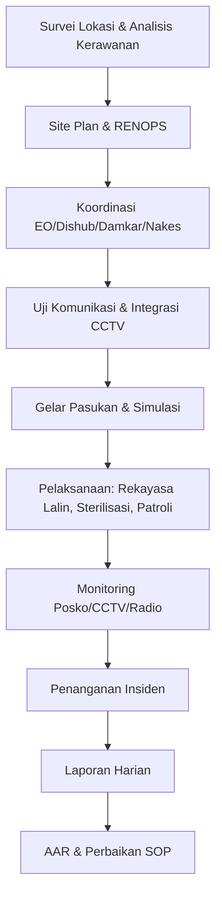
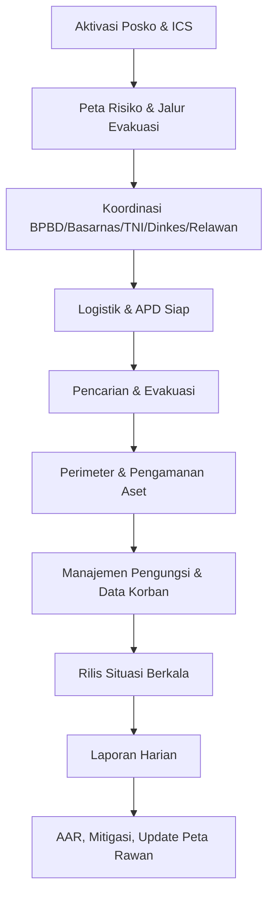
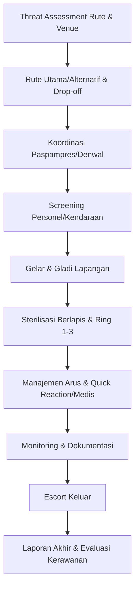

# Diagram Alur Operasional BAGOPS (Ringkas)

```mermaid
graph TD
  A[Perintah/RENOPS Diterima] --> B[Analisis Ancaman & Kerawanan]
  B --> C[Rencana Taktis (kekuatan, rute, posko, komunikasi)]
  C --> D[Rencana Kontinjensi & Logistik]
  D --> E[Briefing & Gelar Pasukan]
  E --> F[Pelaksanaan Operasi]
  F --> G[Monitoring Real-time (CCTV/Radio/Posko)]
  G --> H[Penanganan Insiden & Pengamanan Obvit]
  H --> I[Laporan Harian (Laphar)]
  I --> J[After Action Review (AAR) & Laporan Akhir]
  J --> K[Pembaruan SOP & Rencana Kontinjensi]
```

## Diagram Khusus per Jenis Operasi

### Pengamanan Event/Keramaian


### Penanganan Bencana/SAR


### Pengamanan VVIP/VIP


### Catatan Penggunaan
- Dapat dipakai sebagai referensi cepat untuk briefing.
- Sesuaikan simpul/rantai dengan jenis operasi (event, bencana, VVIP).
- Jika merender mermaid tidak tersedia, gunakan urutan langkah bernomor di bawah:
  1) Perintah/RENOPS diterima
  2) Analisis ancaman & kerawanan
  3) Rencana taktis (kekuatan, rute, posko, komunikasi)
  4) Rencana kontinjensi & logistik
  5) Briefing & gelar pasukan
  6) Pelaksanaan operasi
  7) Monitoring real-time (CCTV/Radio/Posko)
  8) Penanganan insiden & pengamanan obvit
  9) Laporan harian (Laphar)
  10) After Action Review (AAR) & laporan akhir
  11) Pembaruan SOP & rencana kontinjensi
